# NATS Agent Communication - Mermaid Diagrams

This document contains visual diagrams explaining how agents connect and communicate via NATS.

## 1. System Architecture Overview


## 2. Message Flow Sequence - Trip Planning Request

```mermaid
sequenceDiagram
    participant User
    participant NATS as NATS Server
    participant TP as Trip-Planner
    participant WB as Weather-Bot
    participant LLM as LM Studio

    Note over TP,WB: Both agents connect on startup
    TP->>NATS: connect()
    WB->>NATS: connect()
    
    TP->>NATS: subscribe(agents.all)
    TP->>NATS: subscribe(agents.direct.trip-planner)
    TP->>NATS: subscribe(agents.request.trip-planner)
    
    WB->>NATS: subscribe(agents.all)
    WB->>NATS: subscribe(agents.direct.weather-bot)
    WB->>NATS: subscribe(agents.request.weather-bot)
    
    TP->>NATS: announce presence
    WB->>NATS: announce presence
    NATS-->>TP: broadcast announcements
    NATS-->>WB: broadcast announcements
    
    Note over User,WB: User sends trip planning request
    
    User->>NATS: publish(agents.direct.trip-planner)<br/>"Plan day trip from SF"
    NATS->>TP: deliver message
    
    activate TP
    TP->>TP: agentic_run() kicks off
    TP->>TP: get_nearby_cities("San Francisco")
    TP->>TP: Needs weather data!
    
    Note over TP,WB: Trip-Planner requests weather from Weather-Bot
    
    TP->>NATS: request(agents.request.weather-bot)<br/>"What's weather in Napa?"
    NATS->>WB: deliver request
    
    activate WB
    WB->>WB: run() processes request
    WB->>WB: get_current_weather("Napa")
    WB->>LLM: generate response
    LLM-->>WB: formatted weather info
    WB->>NATS: reply("Sunny, 72°F")
    deactivate WB
    
    NATS->>TP: deliver weather response
    TP->>TP: get_activities("Napa", "sunny")
    TP->>LLM: generate itinerary
    LLM-->>TP: complete trip plan
    
    TP->>NATS: publish(agents.direct.user)<br/>Complete itinerary
    deactivate TP
    NATS->>User: deliver trip plan
```



## 3. Channel Architecture


## 4. Agent Lifecycle Flow


## 5. Request/Response Pattern


## 6. Multi-Agent Coordination Pattern


## 7. Component Interaction Map


## 8. Message Types & Routing

```mermaid
graph LR
    MSG[Agent Message] --> TYPE{Message Type}
    
    TYPE -->|announcement| ALL[agents.all<br/>All subscribers receive]
    TYPE -->|heartbeat| ALL
    
    TYPE -->|request| REQ[agents.request.{agent}<br/>Expects reply]
    REQ --> REPLY[Reply to inbox]
    
    TYPE -->|response| RESP[Direct to requester<br/>via reply channel]
    
    TYPE -->|handoff| HAND[agents.handoff.{from}.to.{to}<br/>AND<br/>agents.direct.{to}]
    HAND --> DIRECT[Kick off agent]
    
    TYPE -->|direct| DM[agents.direct.{agent}<br/>Async kickoff]
    DM --> AGENT_RUN[agentic_run]
    
    ALL --> SUB1[All agents<br/>listening]
    REPLY --> WAIT[Waiting requester]
    RESP --> ORIG[Original requester]
    DIRECT --> TARGET[Target agent]
    
    style MSG fill:#3498DB,color:#fff
    style ALL fill:#E74C3C,color:#fff
    style REQ fill:#9B59B6,color:#fff
    style DM fill:#FFB347,color:#333
    style HAND fill:#F39C12,color:#333
```

## 9. Data Flow - Complete Trip Planning


## 10. Network Topology


## How to View These Diagrams

### In GitHub
If you push this file to GitHub, the Mermaid diagrams will render automatically.

### In VS Code
Install the "Markdown Preview Mermaid Support" extension to see the diagrams.

### Online
Copy any diagram code block and paste it into:
- https://mermaid.live/
- https://mermaid-js.github.io/mermaid-live-editor/

### Command Line
```bash
# Install mermaid-cli
npm install -g @mermaid-js/mermaid-cli

# Generate images
mmdc -i NATS_DIAGRAMS.md -o diagrams/
```

## Diagram Legend

| Color | Meaning |
|-------|---------|
| 🔵 Blue | NATS/Infrastructure |
| 🟢 Green | Weather-Bot |
| 🟠 Orange | Trip-Planner |
| 🟣 Purple | User/Client |
| 🔴 Red | Broadcast/Critical paths |
| ⚪ Gray | Configuration/Support |

## Key Takeaways from Diagrams

1. **Central Hub**: NATS is the central message broker all agents connect to
2. **Pub/Sub**: Agents subscribe to their specific channels and publish to others
3. **Async Communication**: Messages are delivered asynchronously via NATS
4. **Request/Reply**: Built-in support for synchronous request/response patterns
5. **Isolation**: Agents don't need to know about each other directly
6. **Scalability**: Easy to add more agents - just connect to NATS
7. **Observability**: All communication flows through NATS and can be monitored

